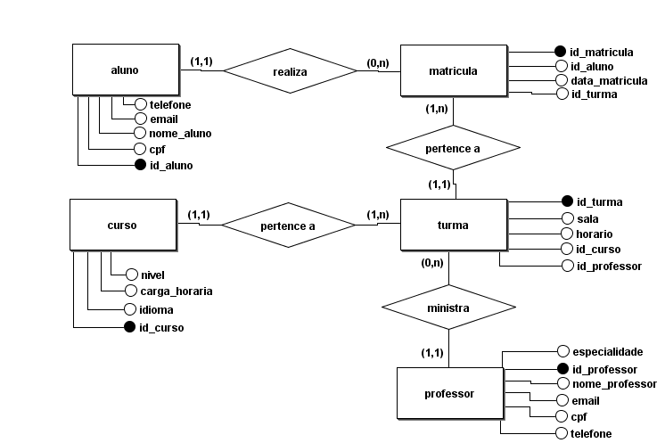
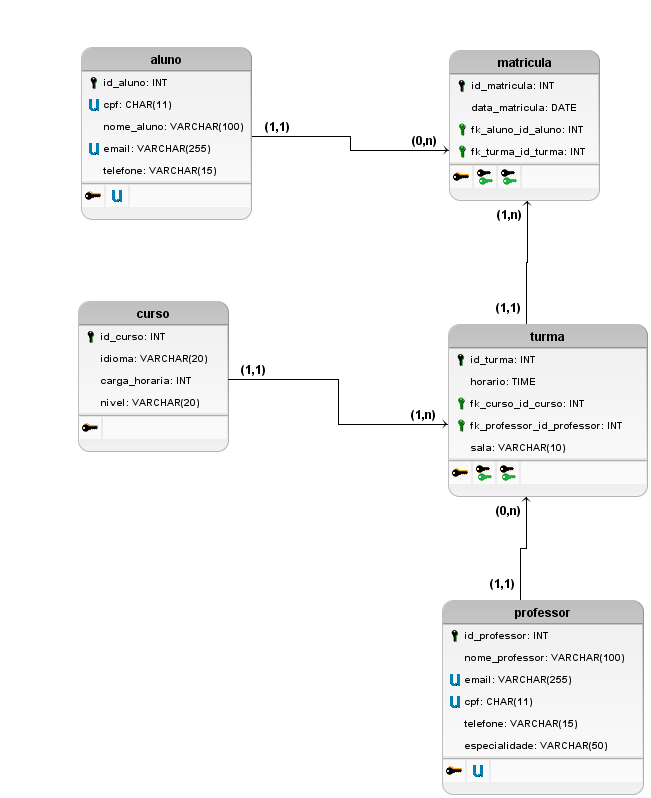

📚 Banco de Dados – Escola de Idiomas

Este repositório apresenta a modelagem de um banco de dados para gerenciamento de uma escola de idiomas.
O projeto inclui dois níveis de modelagem de dados:

Modelo Conceitual (MER) – visão de alto nível das entidades e relacionamentos.

Modelo Lógico (Relacional) – estrutura já preparada para implementação em um banco de dados relacional.

1️⃣ Modelo Conceitual

O Modelo Conceitual representa as entidades principais do sistema e como elas se relacionam.
Ele é independente de tecnologia de banco de dados e foca apenas na estrutura lógica do domínio.

Entidades
👨‍🎓 Aluno

Representa os estudantes matriculados na escola.

Atributos:

id_aluno (PK)

cpf

nome_aluno

email

telefone

📄 Matrícula

Representa o registro da inscrição de um aluno em uma turma.

Atributos:

id_matricula (PK)

id_aluno (FK)

id_turma (FK)

data_matricula

📚 Curso

Define os cursos oferecidos pela escola.

Atributos:

id_curso (PK)

idioma

carga_horaria

nivel

👨‍🏫 Professor

Representa os professores responsáveis pelas turmas.

Atributos:

id_professor (PK)

nome_professor

email

cpf

telefone

especialidade

🏫 Turma

Representa uma turma específica de um curso.

Atributos:

id_turma (PK)

sala

horario

id_curso (FK)

id_professor (FK)

Relacionamentos
Aluno — realiza — Matrícula

Um aluno pode realizar várias matrículas.

Cada matrícula pertence a apenas um aluno.

Cardinalidade:

Aluno (1,1) —— (0,n) Matrícula
Matrícula — pertence a — Turma

Uma matrícula pertence a uma turma.

Uma turma pode ter várias matrículas.

Cardinalidade:

Turma (1,1) —— (1,n) Matrícula
Curso — pertence a — Turma

Um curso pode possuir várias turmas.

Cada turma pertence a um único curso.

Cardinalidade:

Curso (1,1) —— (1,n) Turma
Professor — ministra — Turma

Um professor pode ministrar várias turmas.

Cada turma possui um único professor.

Cardinalidade:

Professor (1,1) —— (0,n) Turma
2️⃣ Modelo Lógico

O Modelo Lógico traduz o modelo conceitual para uma estrutura compatível com bancos de dados relacionais (ex: MySQL, PostgreSQL, SQL Server).

Neste modelo já aparecem:

Tabelas

Chaves primárias (PK)

Chaves estrangeiras (FK)

Tipos de dados

Tabelas
Tabela aluno
Campo	Tipo
id_aluno	INT
cpf	CHAR(11)
nome_aluno	VARCHAR(100)
email	VARCHAR(255)
telefone	VARCHAR(15)

Chave primária:

id_aluno
Tabela professor
Campo	Tipo
id_professor	INT
nome_professor	VARCHAR(100)
email	VARCHAR(255)
cpf	CHAR(11)
telefone	VARCHAR(15)
especialidade	VARCHAR(50)

Chave primária:

id_professor
Tabela curso
Campo	Tipo
id_curso	INT
idioma	VARCHAR(20)
carga_horaria	INT
nivel	VARCHAR(20)

Chave primária:

id_curso
Tabela turma
Campo	Tipo
id_turma	INT
horario	TIME
sala	VARCHAR(10)
fk_curso_id_curso	INT
fk_professor_id_professor	INT

Chave primária:

id_turma

Chaves estrangeiras:

fk_curso_id_curso → curso(id_curso)
fk_professor_id_professor → professor(id_professor)
Tabela matricula
Campo	Tipo
id_matricula	INT
data_matricula	DATE
fk_aluno_id_aluno	INT
fk_turma_id_turma	INT

Chave primária:

id_matricula

Chaves estrangeiras:

fk_aluno_id_aluno → aluno(id_aluno)
fk_turma_id_turma → turma(id_turma)
🔗 Fluxo do Sistema

O funcionamento do banco segue o seguinte fluxo:

Um curso é criado.

Uma turma é aberta para esse curso.

Um professor é associado à turma.

alunos se matriculam nessa turma.

Cada matrícula registra data e vínculo aluno–turma.

🎯 Objetivo do Projeto

Este projeto tem como objetivo:

Demonstrar modelagem de banco de dados.

Apresentar a transição de MER (conceitual) → modelo relacional (lógico).

Servir como exemplo educacional para estudos de SQL e modelagem.
